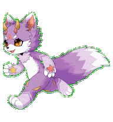
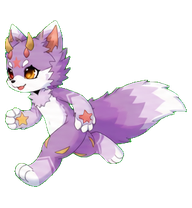
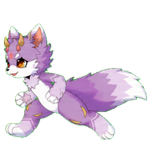
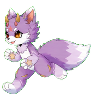
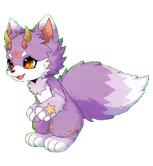

# Starflare — Codex Pet

Starflare is a custom Codex v2 pet based on the supplied lavender horned fox-dragon OC.

<p align="center">
  
</p>

## 运动预览

<p align="center">
  
  
  
  
</p>

逐帧镜像修复后的向左奔跑动作：完整轮廓、统一重心，并保留 Starflare 的蓬松尾焰与异色瞳。

## Contents

- `spritesheet.webp` — the 1536×2288 v2 spritesheet.
- `pet.json` — Codex pet manifest (`spriteVersionNumber: 2`).
- `running-left.gif` — repaired leftward movement preview.
- `previews/` — four featured stills shown at the top of this README.
- `validation-extended.json` — final v2 atlas validation report.
- `chroma-despill-extended.json` — transparency and chroma-edge cleanup report.
- `running-left-mirror-review.json` — verification data for the direct framewise-mirror repair.

## Repair

The original leftward movement contained generated-strip discontinuities. The repair mirrors the already validated final rightward frames one by one, so the leftward loop has exactly the same registration, cadence, scale, and complete silhouette as the rightward loop.

## Install

Copy `spritesheet.webp` and `pet.json` together into your Codex custom-pets directory:

```text
~/.codex/pets/starflare/
```
